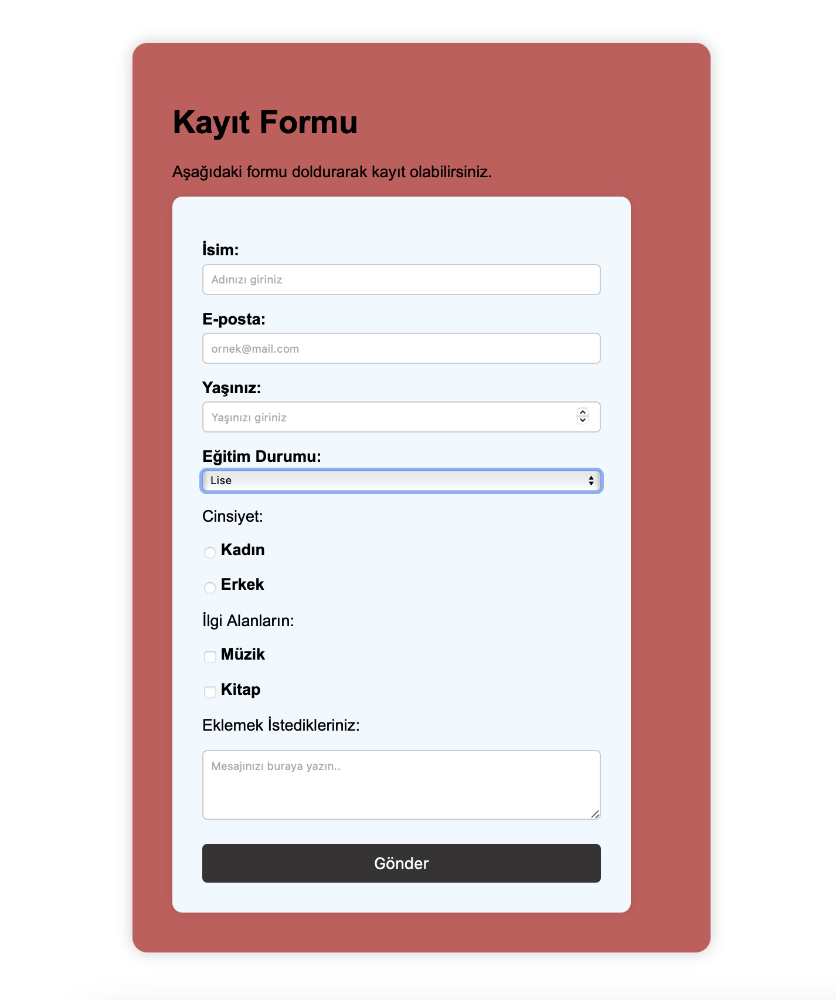

# Kayıt Formu Projesi

Bu projede HTML ve CSS kullanarak basit ama işlevsel bir kayıt formu oluşturdum.  
Form, kullanıcıdan ad, e-posta ve şifre gibi temel bilgileri alacak şekilde tasarlandı.  
Aynı zamanda sade ve anlaşılır bir görünüme sahip, yani kullanıcılar için kullanımı oldukça kolay.

## Proje Görseli

Aşağıda projenin ekran görüntüsünü görebilirsiniz:

